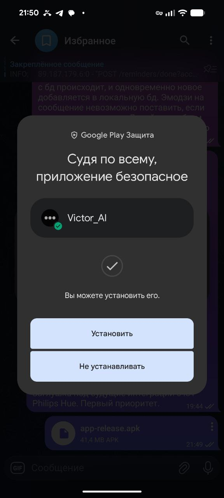
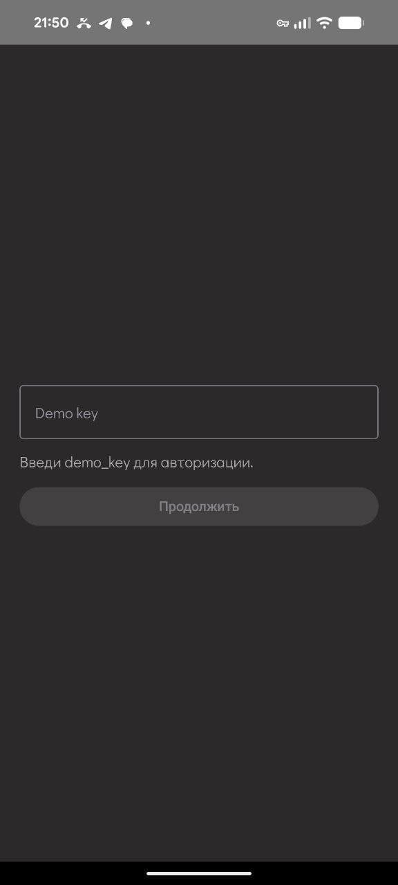

# 🚀 Быстрый старт - Сборка Victor AI для Android

> **Для совсем новичков** - пошаговая инструкция как собрать и установить приложение на свой телефон

---

## 📋 Что вам понадобится

1. **Компьютер** (Windows, macOS или Linux)
2. **Android-телефон** (Android 7.0+)
3. **Интернет** (для скачивания)
4. **1-2 часа свободного времени** (в первый раз)

---

## Шаг 1: Установите Android Studio

### Что это такое?
Android Studio - это программа для создания Android-приложений. Без неё никак.

### Как установить:

1. Перейдите на сайт: https://developer.android.com/studio
2. Нажмите **Download Android Studio**
3. Запустите скачанный файл
4. Следуйте инструкциям установщика (просто нажимайте "Next" / "Далее")
5. Дождитесь окончания установки (может занять 10-30 минут)

**Готово?** ✅ Идём дальше!

---

## Шаг 2: Скачайте проект с GitHub

### Вариант А: Через командную строку (рекомендуется)

1. Откройте **терминал** / **командную строку** (если вы дошли до сюда, вы уже знаете что это по install_guide.md на бэкенде).

2. Перейдите в папку, куда хотите скачать проект:
   ```bash
   cd C:\Users\ВашеИмя\Documents
   ```
   (замените `ВашеИмя` на ваше имя пользователя)

3. Выполните команду:
   ```bash
   git clone https://github.com/YourUsername/Victor_AI.git
   ```
   (замените `YourUsername` на название репозитория)

4. Дождитесь окончания загрузки (может занять 2-5 минут)

### Вариант Б: Скачать ZIP-архив

1. Перейдите на страницу проекта на GitHub
2. Нажмите зелёную кнопку **Code**
3. Выберите **Download ZIP**
4. Распакуйте архив в удобное место

**Готово?** ✅ Идём дальше!

---

## Шаг 3: Настройте ngrok (подключение к серверу)

### Что это такое?
Victor AI нужен сервер (бэкенд), который обрабатывает ваши запросы. Ngrok создаёт ссылку, чтобы ваш телефон мог связаться с сервером.

### Как настроить:

📖 **Следуйте подробному гайду здесь:**
https://github.com/OlgaKalinina101/victor_ai_backend/blob/main/docs/guide_for_junior/how_create_ngrok.md

После настройки у вас будет ссылка вида:
```
https://something.ngrok-free.app
```

**Скопируйте эту ссылку** - она понадобится в следующем шаге.

**Готово?** ✅ Идём дальше!

---

## Шаг 4: Укажите адрес сервера в проекте

### Зачем?
Приложение должно знать, куда отправлять запросы. Без этого оно не заработает.

### Как сделать:

1. Откройте файл:
   ```
   Victor_AI/gradle.properties
   ```
   (можно открыть в блокноте или любом текстовом редакторе)

2. Найдите строку:
   ```properties
   API_BASE_URL=https://your-backend-url.com
   ```

3. Замените `https://your-backend-url.com` на **вашу ссылку от ngrok**:
   ```properties
   API_BASE_URL=https://something.ngrok-free.app
   ```

4. Сохраните файл (`Ctrl + S` или `Cmd + S`)

**Готово?** ✅ Идём дальше!

---

## Шаг 5: Соберите приложение

### Что будем делать?
Сейчас мы превратим код в готовый APK-файл, который можно установить на телефон.

### Как собрать:

1. Откройте **терминал** / **командную строку**

2. Перейдите в папку проекта:
   ```bash
   cd C:\Users\ВашеИмя\Documents\Victor_AI
   ```
   (замените путь на тот, куда вы скачали проект)

3. Выполните команду:
   
   **Для Windows:**
   ```bash
   gradlew.bat assembleRelease
   ```
   
   **Для macOS/Linux:**
   ```bash
   ./gradlew assembleRelease
   ```

4. Дождитесь окончания сборки (может занять 5-15 минут в первый раз)

5. Если всё прошло успешно, вы увидите:
   ```
   BUILD SUCCESSFUL
   ```

**Готово?** 🎉 Приложение собрано!

---

## Шаг 6: Найдите готовое приложение

### Где искать?

Готовый APK-файл находится здесь:
```
Victor_AI\app\build\outputs\apk\release\app-release-unsigned.apk
```

### Как открыть эту папку:

**Windows:**
1. Откройте проводник (Win + E)
2. Перейдите в папку проекта
3. Откройте: `app` → `build` → `outputs` → `apk` → `release`
4. Там лежит файл `app-release-unsigned.apk`

**macOS/Linux:**
```bash
open app/build/outputs/apk/release/
# или
nautilus app/build/outputs/apk/release/
```

**Готово?** ✅ Идём дальше!

---

## Шаг 7: Установите приложение на телефон

### Способ 1: Через USB-кабель (рекомендуется)

1. Подключите телефон к компьютеру через USB
2. На телефоне включите **Режим разработчика**:
   - Откройте **Настройки** → **О телефоне**
   - Нажмите на **Номер сборки** 7 раз подряд
   - Появится сообщение "Вы стали разработчиком!"
3. Включите **Отладку по USB**:
   - Откройте **Настройки** → **Для разработчиков**
   - Включите **Отладка по USB**
4. В терминале выполните:
   ```bash
   adb install app/build/outputs/apk/release/app-release-unsigned.apk
   ```
5. Приложение установится автоматически

### Способ 2: Скопировать файл на телефон

1. Скопируйте файл `app-release-unsigned.apk` на телефон любым способом:
   - Через USB-кабель
   - Через Google Drive
   - Через Telegram/WhatsApp "Избранное"
2. На телефоне откройте файл через **Проводник** / **Файлы**
3. Нажмите **Установить**
4. Если система ругается на "Неизвестные источники":
   - Откройте **Настройки** → **Безопасность**
   - Включите **Установка из неизвестных источников** для вашего проводника

**Готово?** 🎉 Приложение установлено!

---

## 🎊 Поздравляю! Вы собрали и установили Victor AI!

Теперь можно:
- Открыть приложение на телефоне
- Пройти авторизацию
- Начать общаться с Victor
- Пользоваться всеми функциями

### Авторизация в приложении

Подробный гайд как создать себе demo key: https://github.com/OlgaKalinina101/victor_ai_backend/blob/main/docs/autorization%26users.md

<div align="center">
  <table>
    <tr>
      <td align="center">
        <br/>
        <sub>Установка приложения</sub>
      </td>
      <td align="center">
        <br/>
        <sub>Ввод demo key</sub>
      </td>
      <td align="center">
        <br/>
        <sub>Разрешения и главный экран</sub>
      </td>
    </tr>
  </table>
</div>


---

## 🆘 Что-то пошло не так?

### Ошибка при сборке: "BUILD FAILED"

Попробуйте очистить кеш:
```bash
# Для Windows
gradlew.bat clean
gradlew.bat assembleRelease

# Для macOS/Linux
./gradlew clean
./gradlew assembleRelease
```

### APK не устанавливается на телефон

1. Проверьте, что включена **Установка из неизвестных источников**
2. Удалите старую версию Victor AI (если была установлена)
3. Перезагрузите телефон
4. Попробуйте установить снова

### Приложение крашится при запуске

1. Проверьте, что вы **правильно указали API_BASE_URL** в `gradle.properties`
2. Проверьте, что **ngrok запущен** и туннель работает
3. Пересоберите приложение: `./gradlew clean assembleRelease`

### У меня другая проблема

Скопируйте текст ошибки и спросите у ChatGPT, Claude или любого другого AI-ассистента:

> "Я собираю Android-приложение Victor AI по инструкции QUICK_START.md.
> У меня возникла ошибка на шаге [номер шага]: [текст ошибки].
> Помоги разобраться, что делать."

Гайд, как с ними общаться - здесь: https://github.com/OlgaKalinina101/victor_ai_backend/blob/main/docs/guide_for_junior/how_ask_chatgpt.md

---

## 📚 Дополнительные материалы

**Если хотите разобраться глубже:**

- [`docs/README.md`](docs/README.md) - Документация по экранам

**Документация бэкенда:**
- [Установка бэкенда](https://github.com/OlgaKalinina101/victor_ai_backend)
- [Настройка ngrok](https://github.com/OlgaKalinina101/victor_ai_backend/blob/main/docs/guide_for_junior/how_create_ngrok.md)

---

## 🤝 Нужна помощь?

Не стесняйтесь спрашивать у AI-ассистентов (ChatGPT, Claude, DeepSeek, Grok):
- Они отлично разбираются в Android Studio
- Могут помочь с настройкой ngrok
- Объяснят любую ошибку

**Главное правило:** Чем подробнее опишете проблему - тем точнее будет ответ!

---

**Удачи! 🚀 Вы справитесь!**
