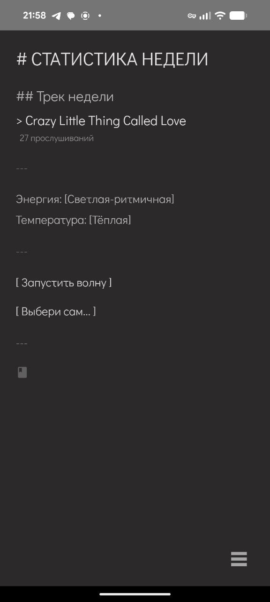

Этот файл является частью проекта Victor AI

Проект распространяется под лицензией GNU Affero General Public License v3.0 (AGPL-3.0).

Подробности лицензии: https://www.gnu.org/licenses/agpl-3.0.html  
Полный текст: **[LICENSE.txt](../LICENSE.txt)** в корне репозитория.

Copyright © 2026 Olga Kalinina

---

## Экран "Плейлист" (Playlist)

> Музыкальный плеер с AI-ассистированным подбором треков, фильтрацией по энергии/температуре и offline кешированием

Плейлист Victor AI — это интеллектуальный музыкальный плеер, который подбирает треки на основе настроения пользователя. Поддерживается ручной выбор, автоматический подбор через AI, фильтрация и статистика прослушиваний.

### Основные функции:
- **AI-подбор треков** - "Выбери сам" с reasoning в реальном времени
- **Волны (Waves)** - генерация плейлистов по энергии/температуре
- **Фильтрация** - по энергии и температуре треков
- **Статистика** - топ треков, общее время прослушиваний
- **Моменты** - история AI-подборов с reasoning
- **Offline кэш** - загрузка треков для прослушивания без интернета
- **MediaSession** - управление с lock screen и bluetooth

### Требования:
Для работы экрана необходима заполненная БД с треками на бэкенде.  
📖 [Гайд по заполнению БД](https://github.com/OlgaKalinina101/victor_ai_backend/blob/main/docs/tools.md)

### API эндпоинты:

#### Треки:
- **GET `/tracks`** - получение всех треков пользователя
  - Возвращает список треков с метаданными (энергия, температура)
  - Поддержка пагинации через `offset` и `limit`

- **GET `/tracks/stream/{track_id}`** - стриминг трека
  - Возвращает аудио поток для воспроизведения

#### Статистика и история:
- **GET `/tracks/stats`** - агрегированная статистика прослушиваний
  - `total_plays`, `top_tracks`, `top_energy`, `top_temperature`, `average_duration`

- **GET `/tracks/playlist_moments`** - история AI-подборов
  - Список моментов с reasoning (stage1, stage2, stage3) и выбранным треком

#### Интеллектуальный подбор:
- **POST `/tracks/choose_for_me`** - AI выбирает трек с streaming reasoning
  - Возвращает SSE stream с логами мыслительного процесса
  - В конце отправляет выбранный трек

- **POST `/tracks/run_playlist_wave`** - генерация "волны" треков
  - Параметры: `energy`, `temperature`
  - Возвращает список треков с указанными характеристиками
  - Треки выбираются из помеченных пользователем

#### Метаданные:
- **POST `/tracks/update_track_description`** - обновление энергии/температуры трека
  - Параметры: `track_id`, `energy_description`, `temperature_description`

---

## 📸 UI

<table>
  <tr>
    <td align="center"><br><sub>Главный экран плейлиста</sub></td>
    <td align="center"><br><sub>Bottom sheet с треками</sub></td>
    <td align="center"><br><sub>История моментов</sub></td>
    <td align="center"><br><sub>AI подбор "Выбери сам"</sub></td>
  </tr>
</table>

---

# 🎵 Техническая документация

## 📑 Содержание

1. [Обзор](#обзор)
2. [Архитектура состояния](#архитектура-состояния)
3. [Структура файлов](#структура-файлов)
4. [Поток данных](#-поток-данных)
5. [Streaming логи](#-streaming-логи)
6. [Фильтрация и сортировка](#-фильтрация-и-сортировка)
7. [Аудио плеер](#-аудио-плеер)
8. [Лучшие практики](#-лучшие-практики)
9. [Производительность](#-производительность)
10. [Отладка](#-отладка)
11. [Технологический стек](#️-технологический-стек)
12. [Связанные документы](#-связанные-документы)
13. [Будущие улучшения](#-будущие-улучшения)

---

## 🎯 Обзор

Плейлист Victor AI — это музыкальный плеер с **AI-ассистированным подбором треков**, поддержкой **streaming логов**, **фильтрацией по энергии/температуре** и **offline кешированием**.

### Ключевые особенности:

- ✅ **Единое состояние UI** через `PlaylistUiState`
- ✅ **Streaming логи** от ассистента в реальном времени
- ✅ **Реактивная фильтрация** через `combine()` flows
- ✅ **UI модель** с предобработанными данными (`TrackUiModel`)
- ✅ **Оптимизированные корутины** (работают только при необходимости)
- ✅ **Обработка ошибок** с показом пользователю
- ✅ **MediaSession** для lock screen / bluetooth
- ✅ **Offline кеширование** треков

---

## 🏗️ Архитектура состояния

### Единое состояние UI

Всё живёт в одном объекте:

```kotlin
data class PlaylistUiState(
    // 🎵 Треки и плеер
    val tracks: List<TrackUiModel> = emptyList(),
    val currentPlayingTrackId: Int? = null,
    val isPlaying: Boolean = false,
    val currentPosition: Float = 0f,
    
    // 📊 Статистика
    val stats: TrackStats? = null,
    
    // 🔄 Состояния загрузки
    val isLoading: Boolean = false,
    val isWaveLoading: Boolean = false,
    
    // ⚠️ Ошибки
    val error: ErrorState? = null,
    
    // 🔍 Фильтры (единая точка правды)
    val energyFilter: String? = null,
    val temperatureFilter: String? = null,
    val sortBy: String = "recent",
    val energyOptions: List<String> = emptyList(),
    val temperatureOptions: List<String> = emptyList(),
    
    // 🎵 Streaming логи
    val streamingLog: String = ""
)
```

---

## 📁 Структура файлов

```
ui/playlist/
├── PlaylistScreen.kt              # Главный экран с markdown статистикой
├── PlaylistSheet.kt               # Bottom sheet со списком треков
├── PlaylistViewModel.kt           # Бизнес-логика и состояние
├── PlaylistUiState.kt            # Модели состояния (UiState, TrackUiModel, ErrorState)
├── AmbientStreamInline.kt        # Компонент для отображения streaming логов
├── PLAYLIST_ARCHITECTURE.md      # Внутренняя документация
├── QUICK_REFERENCE.md            # Краткая справка
│
└── components/
    ├── CurrentTrackPlayer.kt     # Мини-плеер с прогресс-баром
    ├── TrackItem.kt              # Элемент списка трека (обычный)
    ├── TrackItemWithCheckbox.kt  # Элемент с чекбоксом (для выбора)
    ├── EditTrackSheet.kt         # Bottom sheet для редактирования метаданных
    └── PlaylistUtils.kt          # Утилиты (formatDuration, цвета)

data/network/
├── MusicApi.kt                   # API интерфейс Retrofit
├── MusicApiImpl.kt              # Реализация со streaming
└── Track, TrackStats, WaveResponse # DTOs

data/repository/
└── PlaylistRepository.kt         # Репозиторий (опционально)

logic/
├── AudioPlayer.kt               # Обёртка над ExoPlayer + MediaSession
└── MusicPlaybackService.kt     # Foreground Service для уведомлений
```

---

## 🔄 Поток данных

### 1. Загрузка треков

```
┌─────────────┐
│ User opens  │
│ PlaylistScreen │
└──────┬──────┘
       │
       ▼
┌─────────────────┐
│ ViewModel.init()│
│ - loadTracks()  │ ──┐
│ - loadStats()   │   │
└─────────────────┘   │
                      │
                      ▼
            ┌──────────────────┐
            │ musicApi.getTracks() │
            └──────┬───────────┘
                   │
                   ▼
         ┌──────────────────┐
         │ _rawTracks.value │ (List<Track> - DTO)
         └──────┬───────────┘
                │
                ▼
    ┌────────────────────────────┐
    │ startUiStateUpdater()      │
    │ combine(                   │
    │   _rawTracks,              │
    │   _trackCacheStates,       │
    │   _uiState                 │
    │ ) { ... }                  │
    └──────┬─────────────────────┘
           │
           ▼
    ┌──────────────────┐
    │ Track → TrackUiModel  │ (Маппинг)
    │ - formatDuration()    │
    │ - getEnergyColor()    │
    │ - getTemperatureColor() │
    └──────┬───────────────┘
           │
           ▼
    ┌──────────────────┐
    │ Фильтрация       │
    │ + Сортировка     │
    └──────┬───────────┘
           │
           ▼
    ┌──────────────────┐
    │ _uiState.update  │
    │ { it.copy(       │
    │   tracks = ...   │
    │ )}               │
    └──────┬───────────┘
           │
           ▼
    ┌──────────────────┐
    │ UI collectAsState│
    │ → Рекомпозиция   │
    └──────────────────┘
```

### 2. Воспроизведение трека

```
User clicks Play
      │
      ▼
viewModel.playTrack(trackId)
      │
      ├─→ Найти Track в _rawTracks
      ├─→ audioPlayer.updateTrackMetadata()
      ├─→ audioPlayer.playFromUrl(streamUrl)
      ├─→ _uiState.update { copy(currentPlayingTrackId, isPlaying=true) }
      └─→ MusicPlaybackService.startPlayback() (Foreground Service)
            │
            └─→ MediaStyle notification с кнопками play/pause/next/prev
```

### 3. Обновление позиции (оптимизированное)

```kotlin
// ✅ Работает ТОЛЬКО при воспроизведении
_uiState.collectLatest { state ->
    if (state.isPlaying) {
        while (isActive && _uiState.value.isPlaying) {
            delay(100)
            val position = audioPlayer.getCurrentPosition()
            _uiState.update { it.copy(currentPosition = position / 1000f) }
        }
    }
}
```

---

## 🎵 Streaming логи

### Как работает streaming:

```
User: "Выбери сам..."
      │
      ▼
viewModel.runAssistantWaveStreaming(manual=true)
      │
      ▼
musicApi.runPlaylistChainStreaming(accountId, "manual") { event ->
    │
    ├─→ {"log": "🎵 анализирую..."}
    │   └─→ _uiState.update { copy(streamingLog = "🎵 анализирую...") }
    │   └─→ delay(типинг + чтение)  // Даём время для анимации
    │
    ├─→ {"log": "🎤 выбираю исполнителя..."}
    │   └─→ _uiState.update { copy(streamingLog = "🎤 выбираю...") }
    │   └─→ delay(типинг + чтение)
    │
    ├─→ {"track": {"track_id": 123, ...}}
    │   └─→ playTrack(123)
    │
    └─→ {"done": true}
        └─→ delay(2000)
        └─→ _uiState.update { copy(streamingLog = "") }
}
```

### Анимация печати в UI:

```kotlin
// PlaylistScreen.kt
LaunchedEffect(uiState.streamingLog) {
    if (uiState.streamingLog.isNotEmpty()) {
        showAmbientStream = true
        typedText = ""
        
        // Печатаем посимвольно
        uiState.streamingLog.forEachIndexed { index, _ ->
            delay(50) // 50мс между символами
            typedText = uiState.streamingLog.take(index + 1)
        }
    } else {
        showAmbientStream = false
    }
}
```

### Timing логов:

```kotlin
// ViewModel рассчитывает время показа каждого лога:
val typingTime = (logText.length * 50L).coerceAtLeast(1000L)
val readingTime = 1500L
delay(typingTime + readingTime)
```

**Пример:**
- Лог "🎵 анализирую твоё настроение..." (37 символов)
- Время печати: 37 × 50мс = **1850мс**
- Время чтения: **1500мс**
- **Итого:** 3.35 секунды перед следующим логом

### ⚠️ Проблема: Ngrok буферизует streaming

**Симптом:** Все логи приходят одним блоком в конце, а не по мере генерации.

**Причина:** Ngrok (даже платный) буферизует HTTP ответы, особенно если они приходят быстро.

**Решения:**

1. **На бэкенде (FastAPI):**
```python
async def jsonlines_stream():
    async for item in builder.build_with_logs():
        line = json.dumps(item, ensure_ascii=False) + "\n"
        yield line
        await asyncio.sleep(0)  # 🔥 Даёт контроль event loop
```

2. **На фронте:**
```kotlin
// Добавляем задержки между логами
delay(typingTime + readingTime)
```

3. **Альтернативные tunnels:**
    - `cloudflared` (Cloudflare Tunnel) — лучше работает со streaming
    - `localtunnel` — простой и без буферизации
    - Прямое подключение через VPN

**Текущее состояние:** Фронт компенсирует буферизацию задержками между логами.

---

## 🔍 Фильтрация и сортировка

### Единая точка правды

Фильтры живут **ТОЛЬКО** в `PlaylistUiState`:

```kotlin
// Фильтры в ViewModel
data class PlaylistUiState(
    val energyFilter: String? = null,
    val temperatureFilter: String? = null,
    val sortBy: String = "recent"
)

// UI просто вызывает методы:
viewModel.updateEnergyFilter("Высокая")
```

### Реактивное обновление

Фильтрация происходит автоматически через `combine()`:

```kotlin
combine(
    _rawTracks,           // Сырые данные с бэкенда
    _trackCacheStates,    // Состояния кеша
    _uiState              // Текущие фильтры
) { rawTracks, cacheStates, currentState ->
    
    // 1. Маппинг Track → TrackUiModel
    val tracksWithCache = rawTracks.map { track ->
        track.toUiModel(cacheStates[track.id] ?: TrackCacheState.NOT_CACHED)
    }
    
    // 2. Фильтрация
    val filtered = tracksWithCache.filter { track ->
        (currentState.energyFilter == null || 
         track.energyDescription == currentState.energyFilter) &&
        (currentState.temperatureFilter == null || 
         track.temperatureDescription == currentState.temperatureFilter)
    }
    
    // 3. Сортировка
    val sorted = when (currentState.sortBy) {
        "title" -> filtered.sortedBy { it.title }
        "artist" -> filtered.sortedBy { it.artist }
        "duration" -> filtered.sortedByDescending { it.duration }
        else -> filtered.sortedByDescending { it.id }
    }
    
    // 4. Обновление UI state
    currentState.copy(tracks = sorted, ...)
    
}.collect { newState ->
    _uiState.value = newState
}
```

При изменении фильтра → автоматически пересчитывается список → UI обновляется!

---

## 🔊 Аудио плеер

### Архитектура плеера

```
┌──────────────────────────┐
│   PlaylistViewModel      │
├──────────────────────────┤
│ - playTrack()            │
│ - pauseTrack()           │
│ - resumeTrack()          │
│ - seekTo()               │
└───────┬──────────────────┘
        │
        ▼
┌──────────────────────────┐
│      AudioPlayer         │ (logic/AudioPlayer.kt)
├──────────────────────────┤
│ - ExoPlayer              │
│ - MediaSession           │
│ - WakeLock / WiFiLock    │
│ - Audio Focus            │
└───────┬──────────────────┘
        │
        ├─→ Callbacks:
        │   - onCompletion → playNextTrack()
        │   - onPlayPause → update _isPlaying
        │   - onNext → playNextTrack()
        │   - onPrevious → playPreviousTrack()
        │
        └─→ MediaSession callbacks:
            - onPlay / onPause / onNext / onPrevious / onSeekTo
```

### MediaSession для lock screen

```kotlin
// AudioPlayer инициализирует MediaSession
private fun initMediaSession() {
    mediaSession = MediaSessionCompat(context, "VictorAI_MediaSession").apply {
        setCallback(object : MediaSessionCompat.Callback() {
            override fun onPlay() { resume() }
            override fun onPause() { pause() }
            override fun onSkipToNext() { onNextCallback?.invoke() }
            override fun onSkipToPrevious() { onPreviousCallback?.invoke() }
            override fun onSeekTo(pos: Long) { seekTo(pos.toInt()) }
        })
        
        setFlags(
            FLAG_HANDLES_MEDIA_BUTTONS or
            FLAG_HANDLES_TRANSPORT_CONTROLS
        )
        
        isActive = true
    }
}

// Обновление метаданных
fun updateTrackMetadata(title: String, artist: String, duration: Long) {
    mediaSession?.setMetadata(
        MediaMetadataCompat.Builder()
            .putString(METADATA_KEY_TITLE, title)
            .putString(METADATA_KEY_ARTIST, artist)
            .putLong(METADATA_KEY_DURATION, duration)
            .build()
    )
}
```

### Foreground Service

```kotlin
// PlaylistViewModel запускает service при воспроизведении
MusicPlaybackService.startPlayback(
    context = applicationContext,
    trackTitle = track.title,
    trackArtist = track.artist,
    isPlaying = true,
    sessionToken = audioPlayer.getMediaSessionToken(),
    duration = track.duration.toLong(),
    position = 0
)
```

**Результат:**
- ✅ Управление с lock screen
- ✅ Управление с bluetooth гарнитуры
- ✅ Воспроизведение в фоне
- ✅ MediaStyle уведомление

---

## 🎯 Лучшие практики

### ✅ DO: Правильная архитектура

```kotlin
// ✅ Единое состояние
val uiState by viewModel.uiState.collectAsState()

// ✅ UI модель с предобработкой
data class TrackUiModel(
    val formattedDuration: String,  // Не Float
    val artist: String,             // Не nullable
    val energyColor: Color          // Готовый цвет
)

// ✅ Логика в ViewModel
viewModel.updateEnergyFilter("Высокая")

// ✅ UI локальные состояния только для UI
var showDropdown by remember { mutableStateOf(false) }

// ✅ Key в LazyColumn
items(tracks, key = { it.id }) { track -> ... }

// ✅ Обработка ошибок
uiState.error?.let { error ->
    ErrorCard(error = error, onDismiss = { viewModel.clearError() })
}
```


## 📊 Производительность

### Оптимизации:

1. **Корутины работают только при необходимости**
    - Position updater: только при `isPlaying = true`
    - Notification updater: реактивный через `combine()`

2. **Фильтрация один раз в ViewModel**
    - Не пересчитывается при каждой рекомпозиции
    - Результат кешируется в `uiState.tracks`

3. **LazyColumn с key**
    - Эффективная рекомпозиция только изменённых элементов

4. **UI модель с предобработкой**
    - Форматирование один раз при маппинге
    - Не пересчитывается при рендере

5. **remember для вычислений**
   ```kotlin
   val editingTrack = remember(editingTrackId, uiState.tracks) {
       editingTrackId?.let { id -> uiState.tracks.firstOrNull { it.id == id } }
   }
   ```

---

## 🐛 Отладка

### Логирование

Включены детальные логи:

```bash
# Фильтр для всех логов плейлиста
adb logcat -s PlaylistViewModel:D MusicApiImpl:D AudioPlayer:D

# Или в Android Studio Logcat:
tag:PlaylistViewModel OR tag:MusicApiImpl OR tag:AudioPlayer
```

### Ключевые события:

- `🎵 Starting streaming wave` - Начало streaming запроса
- `📡 Response received` - Получен HTTP ответ
- `📝 Stream log` - Получен лог из stream
- `🎧 Stream received track` - Получен трек
- `✅ Stream completed` - Stream завершён
- `❌ Error` - Ошибка

---

## 🛠️ Технологический стек

### UI
- **Jetpack Compose** - современный UI toolkit
- **Material 3** - дизайн-система
- **LazyColumn** - эффективный рендеринг списков
- **BottomSheet** - модальные окна для треков и редактирования

### Архитектура
- **MVVM** - Model-View-ViewModel паттерн
- **Hilt** - Dependency Injection
- **Kotlin Coroutines** - асинхронность
- **StateFlow** - reactive state management
- **combine()** - реактивная фильтрация и трансформация

### Аудио
- **ExoPlayer** - мощный аудио/видео плеер от Google
- **MediaSession** - интеграция с системными медиа-контролами
- **AudioManager** - управление audio focus
- **WakeLock / WiFiLock** - предотвращение засыпания при воспроизведении

### Сеть
- **Retrofit + Moshi** - HTTP клиент и JSON
- **SSE (Server-Sent Events)** - стриминг reasoning от AI
- **OkHttp** - низкоуровневый HTTP клиент

### Производительность
- **UI модель (TrackUiModel)** - предобработка данных
- **remember** - мемоизация вычислений
- **key** в LazyColumn - эффективная рекомпозиция
- **Conditional coroutines** - работают только при необходимости

### Сервисы
- **Foreground Service** - воспроизведение в фоне
- **MediaStyle Notification** - системное уведомление с кнопками

---

## 📚 Связанные документы

- [places.md](places.md) - Экран "Места" с игровой картой
- [calendar.md](calendar.md) - Экран "Расписание"
- [chat.md](chat.md) - Экран "Чат"
- [README.md](README.md) - Обзор всей документации

---

## 🚀 Будущие улучшения

- [ ] Создание пользовательских плейлистов
- [ ] Экспорт/импорт плейлистов
- [ ] Lyrics display (синхронизированные тексты)
- [ ] Эквалайзер с пресетами
- [ ] Sleep timer (таймер сна)
- [ ] Кроссфейд между треками
- [ ] Скробблинг в Last.fm / ListenBrainz
- [ ] Визуализация аудио (waveform)
- [ ] Социальные функции (делиться треками)
- [ ] Умные плейлисты на основе истории


