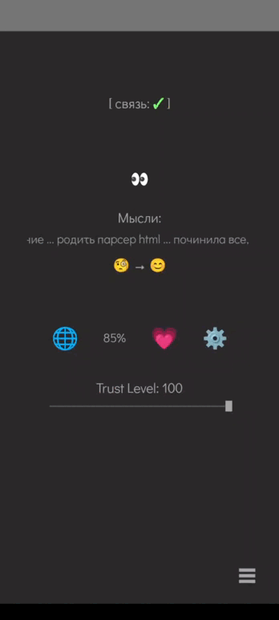
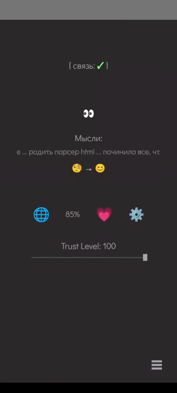

Этот файл является частью проекта Victor AI

Проект распространяется под лицензией GNU Affero General Public License v3.0 (AGPL-3.0).

Подробности лицензии: https://www.gnu.org/licenses/agpl-3.0.html  
Полный текст: **[LICENSE.txt](../LICENSE.txt)** в корне репозитория.

Copyright © 2026 Olga Kalinina

---

## Экран "Системное" (System)

> Системный экран для мониторинга состояния Victor AI, управления настройками и просмотра воспоминаний

Экран "Системное" показывает внутреннее состояние AI-ассистента Victor, позволяет настраивать параметры приложения и просматривать воспоминания.

### Основные функции:
- **Индикатор связи** - живой ли бэкенд (связь ✓/✗)
- **VictorEyes** - анимация глаз ассистента
- **Мысли (Mind)** - бегущая строка с текущими мыслями Victor
- **Эмоциональный сдвиг** - история изменений настроения
- **Баланс токенов** - оставшийся баланс по провайдеру (%)
- **Выбор LLM провайдера** - переключение между OpenAI, Anthropic и др.
- **Настройки SoundPlayer** - громкость вибрации и звука в чате
- **Trust Level** - шкала уровня доверия
- **Воспоминания (Memories)** - просмотр и управление памятью Victor

### API эндпоинты:

#### Состояние ассистента:
- **GET `/assistant/assistant-state`** - получение настроения Victor
  - Возвращает эмодзи и текстовое описание состояния

- **GET `/assistant/assistant-mind`** - получение мыслей Victor
  - Бегущая строка с текущими размышлениями ассистента

#### Токены и использование:
- **GET `/assistant/usage`** - статистика по токенам
  - Баланс по провайдерам
  - Использованные и доступные токены
  - Список моделей и провайдеров

#### Воспоминания:
- **GET `/assistant/memories`** - получение всех воспоминаний
  - Список memories с текстом и датой создания

- **DELETE `/assistant/memories/delete`** - удаление воспоминания
  - Параметр: `memory_id`

- **PUT `/assistant/memories/update`** - обновление воспоминания
  - Параметры: `memory_id`, новый текст

---

## 📸 UI

<div align="center">
  <table>
    <tr>
      <td align="center">
        <br/>
        <sub>Системное 1</sub>
      </td>
      <td align="center">
        <br/>
        <sub>Системное 2</sub>
      </td>
      <td align="center">
        <br/>
        <sub>Системное 3</sub>
      </td>
    </tr>
  </table>
</div>

---

# 🛰 Техническая документация

## 📑 Содержание
1. [Обзор](#обзор)
2. [Структура файлов](#структура-файлов)
3. [Компоненты UI](#компоненты-ui)
4. [SystemScreenViewModel](#systemscreenviewmodel)
5. [Data Flow](#-data-flow)
6. [Бегущая строка мыслей](#-бегущая-строка-мыслей)
7. [Баланс токенов и провайдеры](#-баланс-токенов-и-провайдеры)
8. [Настройки SoundPlayer](#️-настройки-soundplayer)
9. [Воспоминания (Memories)](#-воспоминания-memories)
10. [Оптимизации и UX-фишки](#-оптимизации-и-ux-фишки)
11. [Технологический стек](#️-технологический-стек)
12. [Связанные документы](#-связанные-документы)
13. [Будущие улучшения](#-будущие-улучшения)

---

## 🎯 Обзор

Экран **SystemMenuScreen** показывает «системное состояние» Victor AI:

- **Связь с сервером** – текстовый индикатор `[ связь: ✓ ]`
- **Глаза Victor** – базовое состояние ассистента
- **Мысли ассистента** – бесконечная бегущая строка
- **Эмоциональный сдвиг** – отображение последних изменений настроения
- **Баланс токенов и провайдеры** – оставшийся баланс по провайдеру, выбор провайдера
- **Настройка вибрации и звука в чате** – ползунки громкости
- **Trust Level** – уровень доверия к ассистенту
- **Memories** – отдельный лист с «воспоминаниями» ассистента

Экран читает всё состояние из одного `SystemScreenState`, который заполняет `SystemScreenViewModel`.

---

## 📁 Структура файлов

```text
ui/screens/system/
├── SystemScreen.kt                 # Главный экран и композиция UI
├── SystemScreenComponents.kt       # Отдельные composable-компоненты
├── SystemScreenState.kt            # Data-класс состояния экрана
├── SystemScreenViewModel.kt        # ViewModel с бизнес-логикой и загрузкой данных
└── SoundPlayerSettingsViewModel.kt # ViewModel для настроек звука/вибрации

data/settings/
├── SoundPlayerSettings.kt          # Data class для настроек
└── SoundPlayerSettingsRepository.kt # Repository с SharedPreferences

data/network/
├── AssistantStateApi.kt            # API для состояния ассистента
└── dto/
    ├── AssistantRequestDto.kt      # DTOs для запросов
    └── AssistantResponseDto.kt     # DTOs для ответов
```

---

## 🎨 Компоненты UI

### 1. SystemMenuScreen

```kotlin
@Composable
fun SystemMenuScreen(
    modifier: Modifier = Modifier,
    viewModel: SystemScreenViewModel = hiltViewModel()
)
```

**Ответственность:**
- Поднимает `SystemScreenViewModel` через `hiltViewModel()`
- Подписывается на `state: StateFlow<SystemScreenState>` через `collectAsState()`
- Отдаёт этот `state` в `SystemStatusCard`

Структура:
- `Column` с отступами и центрированием по горизонтали
- Внутри — только `SystemStatusCard` + `Spacer` снизу

---

### 2. SystemStatusCard

```kotlin
@Composable
fun SystemStatusCard(
    state: SystemScreenState,
    onModelChanged: (String) -> Unit,
    modifier: Modifier = Modifier
)
```

**Содержимое (сверху вниз, с учётом offset):**

```text
┌────────────────────────────────────────────┐
│ [ связь: ✓ ]                              │  ← ConnectionStatusIndicator (y = 60 dp)
├────────────────────────────────────────────┤
│ VictorEyes                                │  ← Статичные глаза, центрированы (y = 120 dp)
├────────────────────────────────────────────┤
│ Мысли:  [   Бегущая строка мыслей   ]     │
├────────────────────────────────────────────┤
│ Эмоциональный сдвиг (эмодзи)              │
├────────────────────────────────────────────┤
│ 🌐   95%   😌                             │  ← OrbitalIconsRow (y = 180 dp)
├────────────────────────────────────────────┤
│ Trust Level: [────■────]                  │  ← TrustLevelSlider (y = 220 dp)
├────────────────────────────────────────────┤
│ Баланс токенов (expandable Card)          │  ← TokenBalancePanel (y = 220 dp, если открыт)
└────────────────────────────────────────────┘
```

**Локальное UI-состояние:**
- `showBalancePanel: Boolean` – открыт ли блок «Баланс токенов»
- `showProviderDropdown: Boolean` – открыт ли список провайдеров
- `showMemoriesSheet: Boolean` – открыт ли `MemoriesBottomSheet`

**Связи:**
- `onModelChanged` → делегирует в `SystemScreenViewModel.updateModel(newModel)`
- `state` содержит всё, что нужно для отрисовки: `isOnline`, `assistantMind`, `assistantState`, `trustLevel`, `usageByProvider`, `displayProvider`, `modelUsageList`, `emotionalShift` и т.д.

---

## 🧠 SystemScreenViewModel

```kotlin
@HiltViewModel
class SystemScreenViewModel @Inject constructor(
    private val usageRepository: UsageRepository
) : ViewModel() {
    private val apiService = RetrofitInstance.apiService
    private val assistantApi = RetrofitInstance.assistantApi

    private val _state = MutableStateFlow(SystemScreenState())
    val state: StateFlow<SystemScreenState> = _state.asStateFlow()
}
```

### Основные обязанности:

1. **Инициализация экрана (`init { loadAllData() }`):**
    - `checkConnection()` – проверка связи с сервером
    - `loadChatMeta()` – загрузка `trust_level` и `model`
    - `loadModelUsage()` – usage по моделям и провайдерам
    - `loadAssistantData()` – `assistantState`, `assistantMind`, `emotionalShift`

2. **Обновление модели/провайдера (`updateModel(newModel: String)`):**
    - Отправляет `PATCH /chat-meta` через `apiService.updateChatMeta`
    - При успехе обновляет `currentModel` в `state`
    - Вся сетевая логика по смене провайдера/модели находится ТОЛЬКО во ViewModel

3. **Расчёт эмоционального сдвига (`calculateEmotionalShift`)**
    - Берёт последние состояния ассистента (`AssistantState`)
    - Оставляет до 10 записей, убирает дубли по `state`, берёт последние 2
    - Формат: `"спокойный → нежность"` или `"Эмоциональный сдвиг: Null"`, если данных мало

Все корутины работают в `viewModelScope`, исключения ловятся и логируются — экран не падает при сетевых ошибках.

---

## 🔄 Data Flow

Высокоуровневая схема:

```text
┌────────────────────────┐
│  Backend API           │
│  - checkConnection     │
│  - chat meta           │
│  - usage               │
│  - assistant state     │
│  - assistant mind      │
└─────────┬──────────────┘
          │
          ↓
┌────────────────────────┐
│ Retrofit + Repositories│
│  - UsageRepository     │
└─────────┬──────────────┘
          │
          ↓
┌────────────────────────┐
│ SystemScreenViewModel  │
│  - MutableStateFlow    │
│  - loadAllData()       │
└─────────┬──────────────┘
          │
          ↓
┌────────────────────────┐
│ SystemMenuScreen       │
│  - collectAsState()    │
└─────────┬──────────────┘
          │
          ↓
┌────────────────────────┐
│ SystemStatusCard       │
│ + Components           │
└────────────────────────┘
```

**Направление данных:**
- Снизу вверх поднимаются только события (клики):
    - Клик по 🌐 → `onProviderClick` → `showBalancePanel = !showBalancePanel`
    - Клик по провайдеру в списке → `onProviderSelected(newModel)` → `viewModel.updateModel(newModel)`
    - Клик по `ThoughtsSection` → `onMemoriesClick()` → `showMemoriesSheet = true`
    - Клик по ⚙️ → шторка с ползунками для настройки чата

---

## 💭 Бегущая строка мыслей

### ThoughtsSection

```kotlin
@Composable
fun ThoughtsSection(
    assistantMind: List<AssistantMind>,
    onMemoriesClick: () -> Unit,
    grayText: Color,
    fontSize: TextUnit,
    didactGothic: FontFamily,
    modifier: Modifier = Modifier
)
```

**Логика:**
- Заголовок `"Мысли:"`
- Если список пуст – показываем `"Тишина..."` **внутри Box фиксированной высоты** (`height(24.dp)`), чтобы верстка не прыгала
- Если мысли есть:
    - Очищаем текст:
        - `\n`, `\r`, `\t` → пробел
        - эскейпнутые кавычки `\"` → обычные `"`
        - `trim()` по краям
    - Склеиваем через `" ... "`
    - Передаём в `InfiniteMarqueeText`
- Весь блок кликабелен и открывает `MemoriesBottomSheet`

### InfiniteMarqueeText

```kotlin
@Composable
fun InfiniteMarqueeText(
    text: String,
    fontSize: TextUnit = 18.sp,
    color: Color = Color.Gray,
    fontFamily: FontFamily? = null,
    speed: Float = 360f,
    space: String = " ... ",
    modifier: Modifier = Modifier
)
```

**Работа:**
- Дублирует текст: `"$text$space$text"` → создаётся ощущение цикла
- Использует `rememberScrollState()` и `LaunchedEffect(repeatedText)`
- В `while (isActive)`:
    - Берёт `scrollState.maxValue` как полную ширину прокрутки
    - Сбрасывает позицию на 0 через `scrollState.scrollTo(0)`
    - Вычисляет `duration` как `fullWidth / speed` (в мс)
    - Анимированно скроллит до `maxValue` через `scrollState.animateScrollTo(...)`
- `Text` с `maxLines = 1`, `softWrap = false` и `.horizontalScroll(scrollState, enabled = false)`

`isActive` гарантирует, что корутина остановится при выходе composable из композиции → утечек нет.

---

## 🪙 Баланс токенов и провайдеры

### SystemScreenState (выдержка)

```kotlin
data class SystemScreenState(
    val modelUsageList: List<ModelUsage> = emptyList(),
    val trustLevel: Int = 0,
    val currentModel: String? = null
) {
    val usageByProvider: Map<String, List<ModelUsage>>
        get() = modelUsageList.groupBy { it.provider }

    val currentProvider: String?
        get() = if (currentModel != null) {
            modelUsageList.find { it.model_name == currentModel }?.provider
        } else null

    val displayProvider: String
        get() = currentProvider ?: usageByProvider.keys.firstOrNull() ?: "N/A"

    val balancePercent: String
        get() { ... } // вычисляет % оставшегося баланса
}
```

### OrbitalIconsRow

Показывает:
- 🌐 – клик по нему открывает/закрывает `TokenBalancePanel`
- `balancePercent` – строка вида `"95%"`
- Эмодзи настроения (`EmotionMapper.getEmoji(assistantState)`)

### TokenBalancePanel

```kotlin
@Composable
fun TokenBalancePanel(
    usageByProvider: Map<String, List<ModelUsage>>,
    displayProvider: String,
    showProviderDropdown: Boolean,
    onProviderDropdownToggle: () -> Unit,
    onProviderSelected: (String) -> Unit,
    modelUsageList: List<ModelUsage>,
    grayText: Color,
    didactGothic: FontFamily,
    modifier: Modifier = Modifier
)
```

Показывает:
- Заголовок `"Баланс токенов"`
- Текущий провайдер + иконка раскрытия
- Выпадающий список других провайдеров (`ProviderDropdownList`)
- Прогресс-бар оставшегося баланса
- Текст `"X.XX из Y.YY"`

### ProviderDropdownList

Раньше здесь был вызов сетевого запроса, теперь:

- Находит модель для выбранного провайдера:

```kotlin
val newModel = modelUsageList.find { it.provider == provider }?.model_name
```

- Если модель найдена → вызывает `onProviderSelected(newModel)`
- Сетевая логика смены модели делается выше, во ViewModel (`updateModel`)

Таким образом:
- **UI только выбирает модель**
- **ViewModel только общается с сервером**

---

## ⚙️ Настройки SoundPlayer

### SoundPlayerSettingsBottomSheet

```kotlin
@OptIn(ExperimentalMaterial3Api::class)
@Composable
fun SoundPlayerSettingsBottomSheet(
    showSheet: Boolean,
    onDismiss: () -> Unit,
    modifier: Modifier = Modifier,
)
```

**Назначение:**
- Modal bottom sheet для настройки звуковой обратной связи в чате
- Управление громкостью вибрации и звука при печати ответов Victor

**Параметры настройки:**

| Параметр | Диапазон | Описание |
|----------|----------|----------|
| **Вибрация** | 0% - 200% | Интенсивность вибрации при печати символов |
| **Звук** | 0% - 200% | Громкость звука клавиш при печати |

**Логика:**
- 0% - полностью выключает эффект
- 100% - стандартная интенсивность
- до 200% - усиленный эффект

### SoundPlayerSettingsViewModel

```kotlin
@HiltViewModel
class SoundPlayerSettingsViewModel @Inject constructor(
    private val repository: SoundPlayerSettingsRepository,
) : ViewModel() {
    
    val settings: StateFlow<SoundPlayerSettings> = repository.settingsState
    
    fun setVibrationScale(value: Float)
    fun setSoundScale(value: Float)
}
```

**Архитектура:**
```
SystemStatusCard
    ↓ (клик на ⚙️)
SoundPlayerSettingsBottomSheet
    ↓
SoundPlayerSettingsViewModel
    ↓
SoundPlayerSettingsRepository → SharedPreferences
    ↓
SoundPlayer (в ChatBox) читает настройки
```

**Хранение:**
- Настройки сохраняются в SharedPreferences
- Реактивное обновление через StateFlow
- Применяются мгновенно без перезапуска приложения

**Использование:**
```kotlin
// В SystemStatusCard локальное состояние:
var showSoundPlayerSettings by remember { mutableStateOf(false) }

// Клик по иконке ⚙️:
onSettingsClick = { showSoundPlayerSettings = true }

// Рендер шторки:
SoundPlayerSettingsBottomSheet(
    showSheet = showSoundPlayerSettings,
    onDismiss = { showSoundPlayerSettings = false }
)
```

---

## 🧠 Воспоминания (Memories)

### MemoriesBottomSheet

```kotlin
@OptIn(ExperimentalMaterial3Api::class)
@Composable
fun MemoriesBottomSheet(
    showMemoriesSheet: Boolean,
    onDismiss: () -> Unit,
    modifier: Modifier = Modifier
)
```

**Логика:**
- Если `showMemoriesSheet == false` → сразу `return`
- Поднимает `MemoriesViewModel` через `hiltViewModel()`
- Подписывается на `memories`, `error`, `loading` через `observeAsState`
- Через `LaunchedEffect(showMemoriesSheet)` при открытии делает:
    - `viewModel.fetchMemories(UserProvider.getCurrentUserId())`
- Рендерит `ModalBottomSheet` с тёмной темой
- Внутри вызывает `MemoriesSheet` с колбэками `onDelete` / `onUpdate`

Это позволяет из System Screen проваливаться в глубже детализированный экран воспоминаний, не ломая чистую архитектуру: вся бизнес-логика Memories живёт в своём `MemoriesViewModel`.

---

## ✨ Оптимизации и UX-фишки

- **Фиксированная высота блоков**:
    - `ThoughtsSection` – `Box(height = 24.dp)` для текста мыслей
    - Блок эмоционального сдвига в `SystemStatusCard` – `Box(height = 28.dp)`
      → элементы ниже (🌐, Trust Level) не прыгают при приезде данных.

- **Очистка текста мыслей**:
    - Удаление переносов строк и управляющих символов
    - Снятие экранирования кавычек
    - Гарантия, что бегущая строка всегда в одну строку и не ломает верстку.

- **Единый источник истины**:
    - Все сетевые запросы и бизнес-логика живут в `SystemScreenViewModel`
    - Компоненты UI получают уже готовый `SystemScreenState` и только отображают его.

- **Безопасные корутины в Compose**:
    - `InfiniteMarqueeText` использует `LaunchedEffect` + `isActive`
    - `MemoriesBottomSheet` использует `LaunchedEffect(showMemoriesSheet)` и `hiltViewModel()`

---

## 🛠️ Технологический стек

### UI
- **Jetpack Compose** - современный UI toolkit
- **Material 3** - дизайн-система
- **ModalBottomSheet** - модальные окна для Memories и Settings
- **Custom animations** - InfiniteMarqueeText для бегущей строки

### Архитектура
- **MVVM** - Model-View-ViewModel паттерн
- **Hilt** - Dependency Injection
- **Kotlin Coroutines** - асинхронность
- **StateFlow** - reactive state management

### Хранение данных
- **SharedPreferences** - настройки SoundPlayer
- **SoundPlayerSettingsRepository** - абстракция над SharedPreferences

### Сеть
- **Retrofit + Moshi** - HTTP клиент и JSON
- **AssistantStateApi** - специализированный API для ассистента

### Визуализация
- **InfiniteMarqueeText** - бесконечная прокрутка мыслей
- **VictorEyes** - анимация глаз (кастомная отрисовка)
- **Slider** - настройка параметров звука/вибрации

---

## 📚 Связанные документы

- [places.md](places.md) - Экран "Места" с игровой картой
- [calendar.md](calendar.md) - Экран "Расписание"
- [chat.md](chat.md) - Экран "Чат" (использует SoundPlayer)
- [playlist.md](playlist.md) - Экран "Плейлист"
- [README.md](README.md) - Обзор всей документации

---

## 🚀 Будущие улучшения

- [ ] Визуализация эмоционального состояния (график)
- [ ] История изменений настроения Victor
- [ ] Экспорт воспоминаний в JSON/MD
- [ ] Поиск по воспоминаниям
- [ ] Категоризация memories по темам
- [ ] Больше настроек SoundPlayer (разные звуки для разных событий)
- [ ] Темная/светлая тема для системного экрана
- [ ] Детальная статистика использования токенов (графики)
- [ ] Уведомления при низком балансе токенов
- [ ] Автоматическое переключение провайдера при исчерпании баланса


